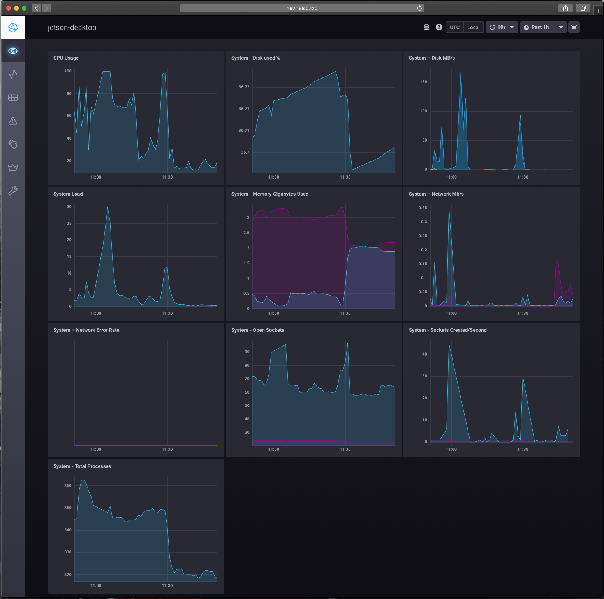

# jetsonNano-Tick
Jetson Nano Telegraf InfluxDB Chronograf Telegraf (Tick)

# Deploy tick stack JetsonNano

## Install 
```
git clone git@gitlab.com:raspirepo/jetsonNano-Tick.git
cd jetsonNano-Tick/setup
./install-tick.sh
```

## Start

```
./start-tick.sh
```

## Status

```
./status-tick.sh
```

## Dashboard
http://localhost:8888/


## System Dashboard



## ESP-32 Dashboard


## Stop

```
./stop-tick.sh
```

